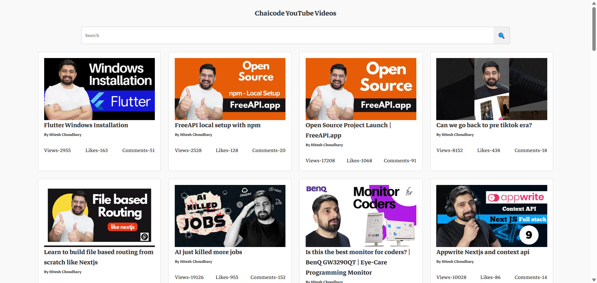

# YouTube Video Listing

## Overview

A YouTube-style video listing page that fetches and displays videos from the FreeAPI YouTube endpoint.

## Features

- **Video Fetching** – Retrieve and display a list of YouTube videos using the FreeAPI.
- **Video Display** – Show video thumbnails, titles, and channel names of videos.
- **Clickable Videos** – Clicking on a video opens it directly in YouTube.
- **Search Functionality** – Users can filter videos dynamically on the frontend without additional API calls.
- **Responsive Grid Layout** – A structured grid-based design for a better user experience.

## Tech Stack

- **Frontend**: HTML, CSS, JavaScript
- **API**: FreeAPI

## Deployment Link

- Go to link:
